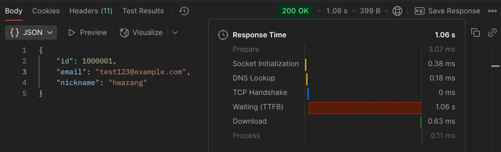
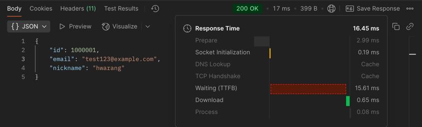
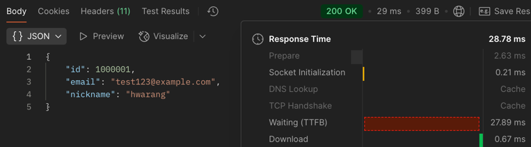

## EC2 인스턴스에서 애플리케이션 실행

### 📌 인스턴스 정보
- **인스턴스 ID**: i-016827737f99ba504
- **퍼블릭 IP 주소**: `52.79.117.155`
- **인스턴스 유형**: t2.micro
- **운영체제**: Ubuntu 24.04 LTS
- **상태**: 실행 중

### 🌐 네트워크 설정
- 퍼블릭 IPv4 활성화 완료
- 보안 그룹: HTTP(80), HTTPS(443), 사용자 지정 TCP(8080), SSH(22) 개방

> EC2 인스턴스 요약 화면 캡처  

---

### ✅ Health Check API

- **URL**: http://52.79.117.155:8080/health
- **응답값**: `OK`
- **접근 가능 여부**: 외부 누구나 가능

> 브라우저 응답 예시  

## 🔍 닉네임 검색 성능 비교

> 일반 JPA 조회

> 인덱싱

> native query

| 방법             | 응답 시간 (ms) | 설명                              |
|------------------|------------|-----------------------------------|
| 기본 JPA 조회     | 1060 ms    | 인덱스 없이 100만 건 중 풀스캔     |
| JPA + 인덱스      | 16 ms      | `@Index` 설정 후 자동 인덱스 적용 |
| Native Query + 인덱스 | 29 ms      | 직접 SQL로 빠른 탐색 수행          |
